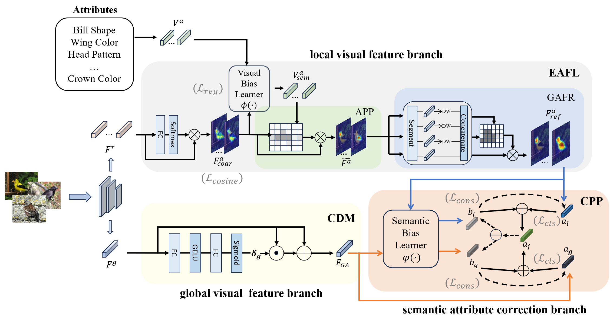

# DFAN++: Enhanced Triple-branch Network for Generalized Zero-Shot Image Classification

[](https://opensource.org/licenses/Apache-2.0)
[]()
[](https://pytorch.org)
[](https://www.sciencedirect.com/journal/neurocomputing)

> Official PyTorch implementation of the paper:  
> **DFAN++: Enhanced Triple-branch Network for Generalized Zero-Shot Image Classification**  
> *Neurocomputing 2025*  

## 📊 Architecture Overview
  
*DFAN++ Framework: Integrating EAFL, CDM and CPP branches*

## 🚀 Performance Highlights
| Dataset | CZSL (acc) | GZSL (U) | GZSL (S) | GZSL (H) | Pretrained Models |
|---------|------------|----------|----------|----------|-------------------|
| **CUB** | 78.7       | 72.9     | 76.8     | 74.8     | xxx |
| **SUN** | 68.1       | 51.4     | 40.5     | 45.3     | xxx |
| **AWA2**| 71.7       | 66.2     | 84.5     | 74.2     | xxx |
| **aPY** | 47.2       | 42.4     | 49.0     | 45.5     | xxx |

## ⚙️ Installation
```bash
# Install dependencies
pip install -r requirements.txt                                             
```

## 📂 Dataset Preparation
| Dataset | Download Link | Attributes | Classes | Images |
|---------|------------|----------|----------|----------|
| **CUB** | [download link](https://www.vision.caltech.edu/datasets/cub_200_2011/)       | 312     | 200     | 11788     |
| **SUN** | [download link](https://cs.brown.edu/~gmpatter/sunattributes.html)       | 102     | 717     | 14340     |
| **AWA2**| [download link](https://cvml.ista.ac.at/AwA2/)       | 85     | 50     | 37322     |
| **aPY** | [download link](https://vision.cs.uiuc.edu/attributes/)       | 64     | 32     | 15399     |

we use standard splits from [*Xian et al.*](https://arxiv.org/abs/1707.00600)

## 🏃 Training & Evaluation
```bash
python xxx                                             
```
We provide trained models on three different datasets: (https://pan.baidu.com/s/1cfN3lu-_fTOc8LaOhmv1Uw?pwd=1111) Extraction code：1111

## ✏️ Citation
```bibtex
{
xxx
}                                             
```

## 🙏 Acknowledgements
Parts of our codes based on:
* [FaisalAlamri0/ViT-ZSL](https://github.com/FaisalAlamri0/ViT-ZSL)
* [GAInuist/DFAN](https://github.com/GAInuist/DFAN)          

## 📧 Contact
If you have any questions about codes, please don't hesitate to contact us by yifanzhu12138@gmail.com.
